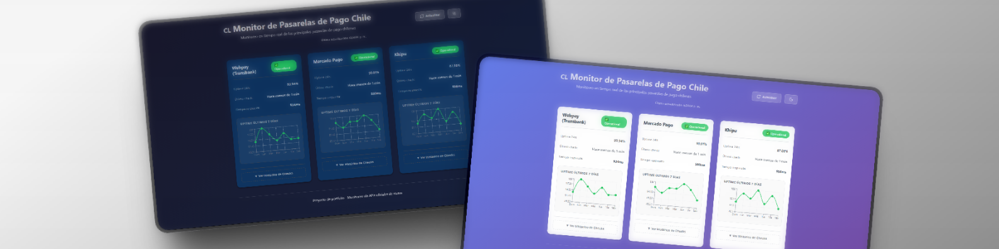
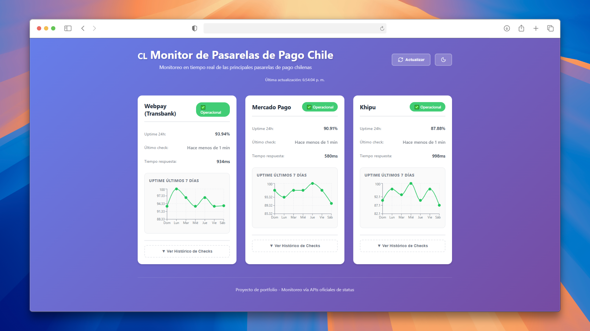
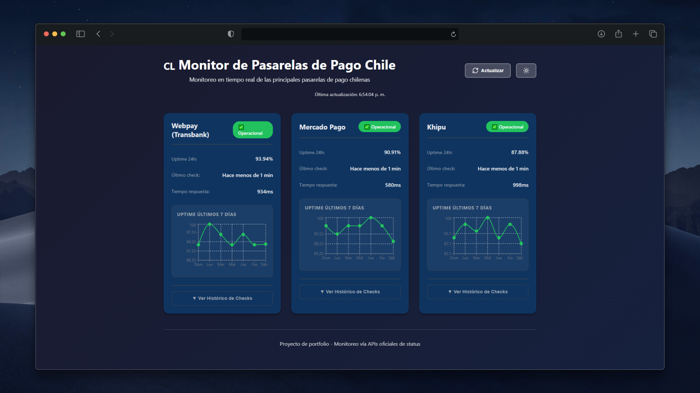
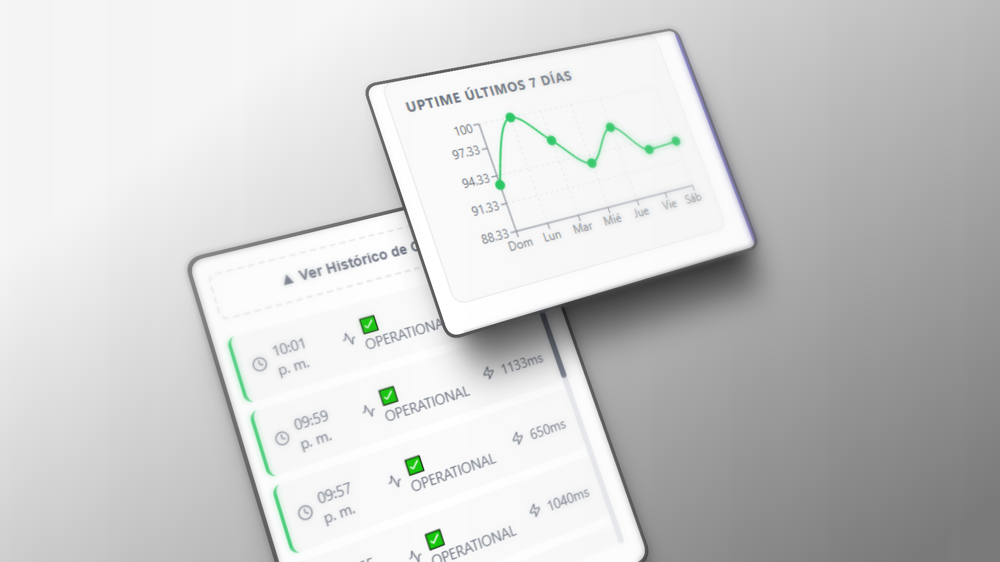

### 🌐 Demo en Vivo
[](https://pasarelas-status-cl.netlify.app/)
# 🇨🇱 Monitor de Pasarelas de Pago Chile

Sistema de monitoreo en tiempo real del estado de las principales pasarelas de pago chilenas.


## 📋 Descripción

> **Proyecto de Portfolio Full-Stack** 

Aplicación web full-stack que monitorea automáticamente el estado de disponibilidad de las pasarelas de pago más utilizadas en Chile, consultando sus APIs oficiales de status cada 2 minutos y generando métricas de uptime en tiempo real.

### 🎯 Pasarelas Monitoreadas

- **Webpay (Transbank)** - Líder del mercado chileno
- **Mercado Pago** - Presencia regional LATAM
- **Khipu** - Especialista en transferencias bancarias

## ✨ Características

### Monitoreo Automático
- ✅ Verificaciones cada 2 minutos vía scheduler
- ✅ 5 estados granulares (Operational, Degraded, Partial Outage, Major Outage, Down)
- ✅ Medición de tiempo de respuesta (ms)
- ✅ Detección automática de incidentes

### Métricas y Analytics
- ✅ Cálculo de uptime últimas 24 horas
- ✅ Gráficos de uptime por día (7 días)
- ✅ Histórico completo de verificaciones
- ✅ Base de datos con timestamps precisos

### Interfaz de Usuario
- ✅ Dashboard en tiempo real
- ✅ Auto-refresh cada 30 segundos
- ✅ Modo oscuro/claro
- ✅ Animaciones suaves
- ✅ Diseño responsive (mobile-first)
- ✅ Gráficos interactivos (Recharts)

## 🛠️ Stack Tecnológico

### Backend
- **FastAPI** - Framework web moderno para Python
- **SQLAlchemy** - ORM para manejo de base de datos
- **APScheduler** - Programación de tareas automáticas
- **Requests** - Cliente HTTP para APIs externas
- **SQLite** - Base de datos (desarrollo) / **PostgreSQL** (producción)
- **Pydantic** - Validación de datos

### Frontend
- **React 18** - Librería UI con Hooks
- **Vite** - Build tool de última generación
- **Axios** - Cliente HTTP
- **Recharts** - Librería de gráficos
- **Lucide React** - Iconos modernos
- **CSS3** - Estilos personalizados con variables CSS

## 📦 Instalación Local

### Requisitos Previos

- Python 3.12+
- Node.js 18+
- Git

### 1. Clonar el Repositorio
```bash
git clone https://github.com/CJaimeDev/pasarelas-status-cl.git
cd pasarelas-status-cl
```

### 2. Configurar Backend
```bash
# Navegar a la carpeta backend
cd backend

# Crear entorno virtual
python -m venv venv

# Activar entorno virtual
# En Windows:
.\venv\Scripts\activate
# En Linux/Mac:
source venv/bin/activate

# Instalar dependencias
pip install -r requirements.txt

# Levantar servidor (desarrollo)
uvicorn main:app --reload
```

El backend estará disponible en: `http://localhost:8000`
Documentación API (Swagger): `http://localhost:8000/docs`

### 3. Configurar Frontend
```bash
# En otra terminal, navegar a frontend
cd frontend

# Instalar dependencias
npm install

# Levantar servidor de desarrollo
npm run dev
```

El frontend estará disponible en: `http://localhost:5173`

## 🚀 Uso

1. Asegúrate de que ambos servidores (backend y frontend) estén corriendo
2. Abre el navegador en `http://localhost:5173`
3. El dashboard mostrará el estado actual de las 3 pasarelas
4. Los datos se actualizan automáticamente cada 30 segundos
5. Expande "Ver Histórico de Checks" para detalles por pasarela
6. Usa el botón de luna/sol para cambiar entre modo claro/oscuro

## 📊 API Endpoints

### Pasarelas
```http
GET /api/gateways
```
Obtiene la lista de todas las pasarelas registradas.

**Respuesta:**
```json
[
  {
    "id": 1,
    "name": "webpay",
    "display_name": "Webpay (Transbank)",
    "url": "https://status.transbankdevelopers.cl/api/v2/status.json"
  }
]
```

### Status Actual
```http
GET /api/status
```
Obtiene el estado actual de todas las pasarelas con uptime 24h.

**Respuesta:**
```json
[
  {
    "gateway": {
      "id": 1,
      "name": "webpay",
      "display_name": "Webpay (Transbank)",
      "url": "https://status.transbankdevelopers.cl/api/v2/status.json"
    },
    "last_check": {
      "id": 45,
      "gateway_id": 1,
      "timestamp": "2026-01-03T14:30:00",
      "status": "OPERATIONAL",
      "response_time": 250
    },
    "uptime_24h": 99.5
  }
]
```

### Histórico de Checks
```http
GET /api/gateways/{gateway_name}/checks?limit=100
```
Obtiene el histórico de verificaciones de una pasarela específica.

**Parámetros:**
- `gateway_name`: webpay | mercadopago | khipu
- `limit`: Cantidad de checks a devolver (default: 100)

### Uptime por Días
```http
GET /api/gateways/{gateway_name}/uptime/days?days=7
```
Calcula el uptime agrupado por día.

**Respuesta:**
```json
[
  {
    "date": "2026-01-03",
    "day": "Vie",
    "uptime": 99.5,
    "checks": 30
  }
]
```

### Verificación Manual
```http
POST /api/check
```
Ejecuta una verificación manual inmediata de todas las pasarelas.


## 📁 Estructura del Proyecto
```
pasarelas-status-cl/
├── backend/
│   ├── venv/                    # Entorno virtual Python
│   ├── main.py                  # Punto de entrada FastAPI
│   ├── models.py                # Modelos SQLAlchemy (Gateway, Check, StatusEnum)
│   ├── database.py              # Configuración de base de datos
│   ├── routes.py                # Endpoints REST API
│   ├── checker.py               # Lógica de verificación de status
│   ├── scheduler.py             # APScheduler config
│   ├── seed.py                  # Datos iniciales (3 pasarelas)
│   ├── requirements.txt         # Dependencias Python
│   └── test.db                  # Base de datos SQLite (dev)
│
├── frontend/
│   ├── src/
│   │   ├── components/
│   │   │   ├── GatewayCard.jsx       # Tarjeta de pasarela
│   │   │   ├── UptimeChart.jsx       # Gráfico de uptime 7 días
│   │   │   └── ChecksHistory.jsx     # Histórico expandible
│   │   ├── App.jsx                   # Componente principal
│   │   ├── App.css                   # Estilos (dark mode, animations)
│   │   └── main.jsx                  # Entry point React
│   ├── public/
│   ├── index.html
│   ├── package.json              # Dependencias Node.js
│   └── vite.config.js            # Configuración Vite
│
├── screenshots/                  # Capturas de pantalla
├── .gitignore
└── README.md                     # Este archivo
```


## 🌐 Metodología de Verificación

### APIs de Status Oficiales

Las tres pasarelas utilizan **StatusPage.io**, permitiendo consultas mediante APIs JSON públicas estandarizadas:

- **Webpay:** `https://status.transbankdevelopers.cl/api/v2/status.json`
- **Mercado Pago:** `https://status.mercadopago.com/api/v2/status.json`
- **Khipu:** `https://status.khipu.com/api/v2/status.json`

### Mapeo de Estados
```python
"none"     → OPERATIONAL        # Todo funcionando normalmente
"minor"    → DEGRADED           # Problemas menores detectados
"major"    → PARTIAL_OUTAGE     # Caída parcial del servicio
"critical" → MAJOR_OUTAGE       # Caída crítica generalizada
timeout    → DOWN               # No responde (timeout)
error      → DOWN               # Error de conexión
```

### Cálculo de Uptime
```
Uptime 24h = (Checks OPERATIONAL / Total Checks) × 100

Ejemplo:
- Total checks en 24h: 720 (cada 2 min)
- Checks OPERATIONAL: 718
- Checks DOWN: 2
- Uptime: (718/720) × 100 = 99.72%
```


## 📄 Licencia

Este proyecto está bajo la Licencia MIT - ver el archivo [LICENSE](LICENSE) para más detalles.


## 📸 Screenshots

### Dashboard - Modo Claro


### Dashboard - Modo Oscuro


### Histórico de Checks y Gráfico de Uptime



---

⭐ Si este proyecto te fue útil, considera darle una estrella en GitHub
